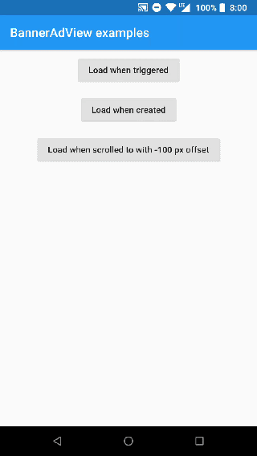

# flutter_appnexus

Flutter plugin for AppNexus SDK

> Disclaimer: This project is not maintained by AppNexus team. It is an independent initiative. Please report any issue or ideas directly into this repository. Pull requests are also welcome.

## Getting Started

### BannerAdView
Widget that shows AppNexus Banners https://wiki.appnexus.com/display/sdk/Show+Banners



### Usage

To use it just import the classes with:
`import 'package:flutter_appnexus/flutter_appnexus.dart';`

Running in `Release mode` boosts the performance quite nicely, but still
this is a PlatformView.

Minimal example to show AppNexus Banner:
```
BannerAdView(
  layoutHeight: 250,
  layoutWidth: 300,
  shouldServePSAs: true,
  placementID: "9924002",
  loadMode: LoadMode.whenCreated(),
)
```

More complex example to show AppNexus Banner, that:
- has a listener
- is triggered by a scroll
- opens in the AppNexus SDK browser
- uses a custom `adWidth` and `adHeight` set to `1` and passed to the
  [setAdSize](https://wiki.appnexus.com/display/ST/BannerAdView#setAdSize-int-int-) function
- shows in a Container widget with height = 250 and width = 300
- shows Public Service Announcements ads
```
import 'package:rxdart/rxdart.dart';

...

_scrollNotifications = PublishSubject<ScrollNotification>();

...

var bannerView = BannerAdView(
  adHeight = 1,
  adWidth = 1,
  layoutHeight: 250,
  layoutWidth: 300,
  shouldServePSAs: true,
  placementID: "9924002",
  clickThroughAction: ClickThroughAction.openSdkBrowser(),
  loadMode: LoadMode.whenScrolledToAd(_scrollNotifications, -100),
  adListener: adListener,
  )

...

NotificationListener<ScrollNotification>(
  onNotification: (ScrollNotification scroll) {
    if (!_scrollNotifications.isClosed) {
      _scrollNotifications.add(scroll);
    }
    return true;
    },
  child: <bannerView somewhere in the tree below>
)
```

#### Required constructor parameters:
* `layoutWidth` - The ad is wrapped in a Container. This is it's width. Must be positive!
* `layoutHeight` - The ad is wrapped in a Container. This is it's height. Must be positive!
* `loadMode` - When would you like to load the ad. More info below.

and a pair of
* `memberId` - The member id that this AdView belongs to.
* `inventoryCode` - The inventory code provides a more human readable way to identify the location in your application where ads will be shown.

or
* `placementID` - The placement ID associated with your app's inventory.

#### Optional constructor parameters:
* `adWidth` - Width of the ad passed to AppNexus native code. If not provided [layoutWidth] is taken by default. Must be positive!
* `adHeight` - Height of the ad passed to AppNexus native code. If not provided [layoutHeight] is taken by default. Must be positive!
* `shouldServePSAs` - Enables Public Service Announcements ads. More info [doc](https://wiki.appnexus.com/display/sdk/Toggle+PSAs)
* `loadsInBackground` - Sets whether or not to load landing pages in the background before displaying them. More info [doc](https://wiki.appnexus.com/display/ST/AdView#setLoadsInBackground-boolean-)
* `resizeAdToFitContainer` - Sets whether ads will expand to fit the BannerAdView. More info [doc](https://wiki.appnexus.com/display/ST/BannerAdView#setResizeAdToFitContainer-boolean-)
* `autoRefreshInterval` - Sets the auto-refresh interval.
* `loadMode` - When would you like to load the ad.
  * `LoadWhenCreated` - automatically loads ad after creating the view in native code
  * `LoadWhenTriggered` - you trigger the ad loading via a Stream
  * `WhenScrolledToAd` - `ScrollNotification` is used to trigger ad loading

* `adListener` - register ad listener which correspond to native code described [here](https://wiki.appnexus.com/display/sdk/Receive+Ad+View+Status+Events) via `AdListenerEvent` events. Just provide the `Sink<AdListenerEvent>` to `adListener` constructor property. Supported events `AdClicked`, `AdRequestFailed`, `AdLoaded`.

* `clickThroughAction` - how the clicked ad is opened:
  * `OpenDeviceBrowser` - opens the ad in the device browser
  * `OpenSdkBrowser` - opens the ad in the AppNexus browser
  * `ReturnUrl`  - decide how to open the clicked ads. Just set a [Sink<AdListenerEvent>] to `adListener` and listen to a `AdClicked` event with
the `AdClicked.clickUrl` parameter.

For more reference on how to use the plugin check the `example` project in this repo.

### TODO
- [ ] Implement iOS
- [ ] Write tests
